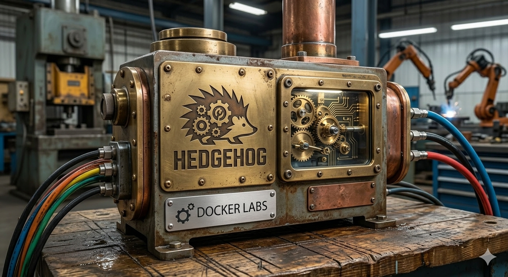
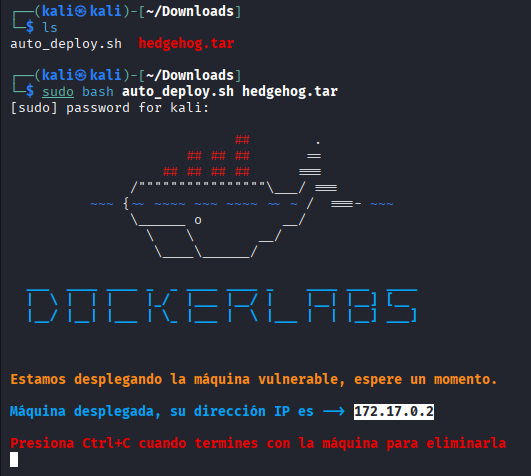
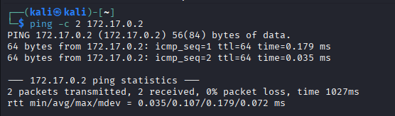
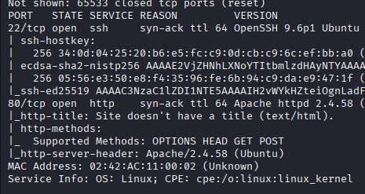
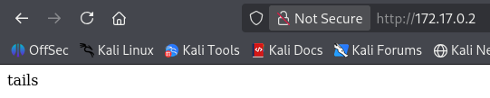
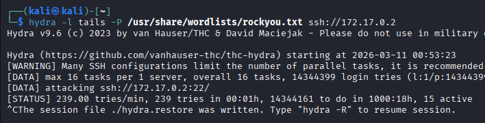
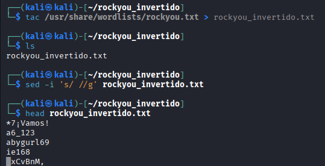
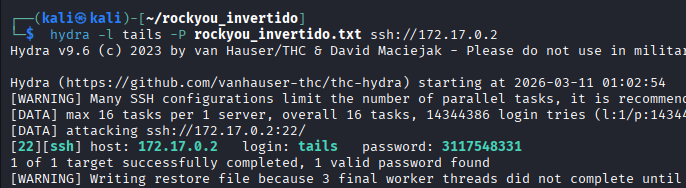
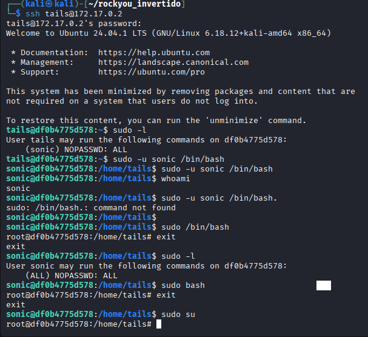

# 🐧🛠️ Hedgehog

## 📄🧾 Información general

- 🖥️ **Máquina:** Hedgehog  
- 🏫 **Plataforma:** DockerLabs  
- 📊 **Dificultad:** Muy fácil  
- 🎯 **Objetivo:** Comprometer la máquina objetivo mediante técnicas básicas de pentesting.  
- 🧪 **Tipo de laboratorio:** Entorno práctico para entrenamiento en **ciberseguridad ofensiva**.  
- 🛠️ **Metodología aplicada:** Reconocimiento, enumeración, explotación y escalada de privilegios.  
- 🐧 **Sistema objetivo:** Probablemente basado en **Linux** según los indicios observados durante el reconocimiento.  

---

## 🎯 Fases del Pentesting

Durante la realización de este laboratorio se aplicaron varias **fases del proceso de pentesting**, entre ellas:

- 🔎 **Reconocimiento** – Identificación inicial del objetivo y recopilación de información básica.
- 🧾 **Enumeración** – Descubrimiento de servicios, usuarios y posibles vectores de ataque.
- 💥 **Explotación** – Uso de técnicas como ataques de fuerza bruta para obtener acceso al sistema.
- ⬆️ **Escalada de privilegios** – Aprovechamiento de configuraciones inseguras para obtener privilegios administrativos.
- 🧠 **Post-explotación** – Verificación del acceso total al sistema comprometido.

---

## 🔎 Reconocimiento

En esta ocasión se trabajará con la máquina Hedgehog, disponible en la plataforma DockerLabs, la cual se encuentra catalogada con un nivel de dificultad muy fácil. Este laboratorio permite poner en práctica técnicas básicas de enumeración, explotación y escalada de privilegios dentro de un entorno controlado de pruebas. 🧠💻

Se lleva a cabo una prueba de conectividad utilizando ping hacia la máquina objetivo. 📡  
La respuesta recibida confirma que existe comunicación con el sistema víctima. Asimismo, se observa un TTL (Time To Live) de 64, valor que comúnmente se asocia con sistemas operativos basados en Linux 🐧, lo que proporciona una primera pista sobre la posible tecnología utilizada por la máquina.

A continuación, se realiza un escaneo de puertos utilizando la herramienta Nmap 🔎 con el objetivo de identificar los servicios expuestos en la máquina objetivo.

Como resultado del análisis, se detectan dos puertos abiertos 🚪:

22/TCP – SSH (Secure Shell) 🔐  
80/TCP – HTTP 🌐  

La presencia del servicio SSH sugiere la posibilidad de acceso remoto al sistema, mientras que el puerto HTTP indica la existencia de un servidor web, el cual podría ser analizado en busca de directorios ocultos, vulnerabilidades o configuraciones inseguras. 🧩

---

## 🧾 Enumeración

Posteriormente, se accede al servicio web a través del navegador introduciendo la dirección IP de la máquina víctima. 🌍  
Al cargar la página correspondiente al puerto 80 (HTTP), se observa contenido que revela un posible nombre de usuario: **"tails"** 👤, el cual podría ser utilizado en fases posteriores de enumeración o autenticación contra otros servicios expuestos, como SSH.

---

## 💥 Explotación

A continuación, se intenta realizar un ataque de fuerza bruta contra el servicio SSH utilizando la herramienta Hydra 🐍 y el diccionario rockyou.txt 📚, empleando el posible usuario identificado previamente.

Sin embargo, debido al gran tamaño del diccionario, el proceso presenta un tiempo de ejecución elevado ⏳, por lo que se decide interrumpir el ataque y optar por otras técnicas de enumeración que permitan obtener credenciales de manera más eficiente.

Para optimizar el diccionario utilizado en el ataque de fuerza bruta, se procede a invertir el contenido del archivo rockyou.txt mediante la herramienta tac 🔄, con el fin de alterar el orden de las contraseñas a probar.

A continuación, se emplea sed 🧹 para eliminar posibles líneas vacías, asegurando que el diccionario contenga únicamente entradas válidas.

Finalmente, se utiliza head 👀 para inspeccionar las primeras líneas del archivo modificado y confirmar que los cambios se hayan realizado correctamente.

Tras optimizar el diccionario, se ejecuta nuevamente un ataque de fuerza bruta contra el servicio SSH utilizando la herramienta Hydra 🐍 y el diccionario rockyou_invertido.txt.

En esta ocasión, el proceso tiene éxito ✅ y se logra obtener una credencial válida 🔑, lo que permite autenticarse en el sistema y avanzar hacia la siguiente fase del laboratorio.

---

## ⬆️ Escalada de privilegios

Una vez obtenidas las credenciales válidas, se establece una conexión remota al sistema mediante el servicio SSH 🔐, utilizando el usuario y la contraseña descubiertos durante el ataque de fuerza bruta.

Tras acceder al sistema, se procede a verificar los privilegios del usuario ejecutando el comando sudo -l ⚙️.

Como resultado, se observa la configuración **(sonic) NOPASSWD: ALL**, lo que indica que el usuario actual tiene permitido ejecutar cualquier comando como el usuario sonic sin necesidad de proporcionar contraseña. ⚠️  
Esta configuración representa una mala práctica de seguridad, ya que facilita la escalada de privilegios dentro del sistema.

Aprovechando esta configuración, se ejecuta el comando **sudo -u sonic /bin/bash**, lo que permite cambiar al usuario sonic y obtener una shell interactiva 💻.

Posteriormente, al ejecutar **sudo /bin/bash**, se obtiene una shell con privilegios de **root** 👑, logrando así completar la escalada de privilegios dentro del sistema.

Como observación adicional, también se comprobó que comandos como **sudo bash** y **sudo su** permiten igualmente obtener acceso como **root** 👑, lo que confirma que la configuración de sudo concede privilegios administrativos completos sin restricciones.

---

## 🛠️⚙️ Herramientas utilizadas

- 📡 **Ping** – Comprobación de conectividad con la máquina objetivo.  
- 🔎 **Nmap** – Escaneo de puertos y detección de servicios activos.  
- 🐍 **Hydra** – Ataque de fuerza bruta contra el servicio SSH.  
- 📚 **rockyou.txt** – Diccionario de contraseñas utilizado durante el ataque.  
- 🔄 **tac** – Utilizado para invertir el orden del diccionario.  
- 🧹 **sed** – Eliminación de líneas en blanco del diccionario.  
- 👀 **head** – Verificación del contenido del diccionario modificado.  
- 🔐 **SSH** – Acceso remoto al sistema comprometido.  

---

## 🔒🛡️ Recomendaciones de seguridad

- 🚫 Evitar configuraciones inseguras en **sudo**, especialmente reglas como **NOPASSWD: ALL**.  
- 🔑 Implementar **contraseñas robustas** para reducir la efectividad de ataques de fuerza bruta.  
- 🛡️ Deshabilitar **autenticación por contraseña en SSH** y utilizar autenticación mediante **claves públicas**.  
- 📉 Aplicar el **principio de mínimo privilegio**, otorgando únicamente los permisos necesarios a cada usuario.  
- 📊 Implementar **sistemas de monitoreo y registro** para detectar intentos de autenticación fallidos.  
- 🔍 Realizar **auditorías periódicas de seguridad** en la configuración del sistema.  

---

## 🧠📚 Conclusión

Este laboratorio permitió poner en práctica técnicas fundamentales utilizadas durante un proceso de **pentesting**, incluyendo **reconocimiento, enumeración de servicios, ataques de fuerza bruta y escalada de privilegios**. 💻🔎

A través del análisis del sistema, fue posible identificar un usuario expuesto en el servicio web 🌐, realizar un ataque de fuerza bruta contra el servicio SSH para obtener credenciales válidas 🔑 y posteriormente aprovechar una **configuración insegura de sudo** para escalar privilegios hasta obtener acceso como **root** 👑.

Este tipo de ejercicios demuestra cómo configuraciones incorrectas y credenciales débiles pueden comprometer completamente la seguridad de un sistema, resaltando la importancia de aplicar **buenas prácticas de seguridad y configuraciones adecuadas** en entornos reales. 🛡️
